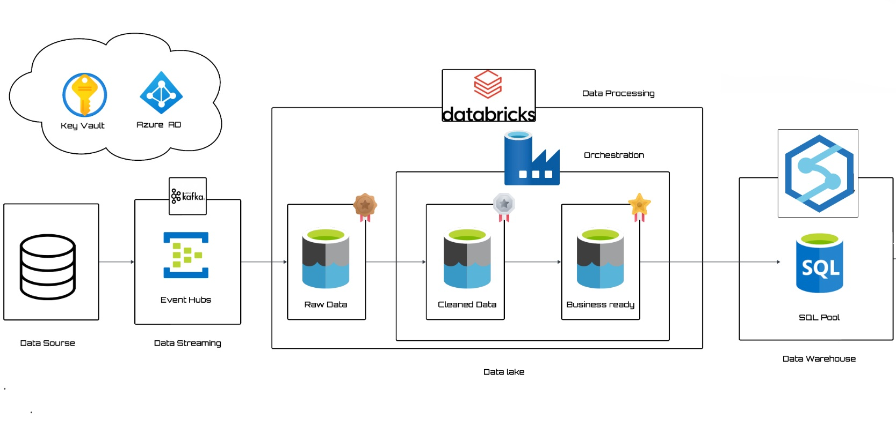
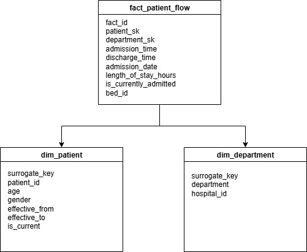

# 🏥 Hospital Analytics Data Pipeline (MHA)

## 1. Business Background  
Midwest Health Alliance (MHA) is a network of **7 hospitals** across the Midwest region.  
The organization faces daily challenges in **patient flow management**, especially during **high-demand periods** (e.g., seasonal flu outbreaks).  

Currently, there is **no centralized, real-time data system** to monitor:  
- Bed occupancy  
- Patient admission/discharge patterns  
- Departmental load  

This lack of visibility leads to **longer patient waiting times** and difficulty in optimizing hospital resources.

---

## 2. Business Objectives  
- **Monitor patient admissions** to minimize waiting times.  
- **Identify department-level bottlenecks** (Emergency, Surgery, ICU, etc.).  
- Enable **gender-based and age-based KPIs** for demographic insights.  
- **Automate alerts** in case of pipeline or data processing failures.  

---

## 3. Functional Requirements  

### 3.1 Data Sources  
1. **Real-time patient admission/discharge data** from hospital registration systems.  
2. **Daily batch extracts** from Electronic Health Records (EHR) systems.  
3. **Department metadata** (capacity, staff numbers).  

### 3.2 Data Processing & Storage  
- Store data in a **Medallion architecture** (Bronze → Silver → Gold).  
- Handle **schema evolution** when new patient attributes are introduced.  
- Implement **Slowly Changing Dimension Type 2 (SCD2)** for patient and department history.  
- Create a **Star Schema** for analytics queries.  

### 3.3 Analytics  
- Use **Azure Synapse** for query execution.  

### 3.4 Orchestration & Automation  
- Use **Azure Data Factory (ADF)** to:  
  - Automate daily batch ingestion from EHR.  
  - Trigger real-time processing pipelines.  
  - Refresh Gold-layer for analytics queries.  

### 3.5 Data Quality  
- Simulate **dirty data issues** (e.g., missing admission times, invalid ages, duplicate IDs, wrong timestamps).  
- Apply **cleaning rules** in the **Silver layer** to standardize data.  

### 3.6 Security & Compliance  
- Implement **role-based access control (RBAC)** across hospital departments.  

---

## 4. Deliverables  
- Fully functional **Azure-based data pipeline**.  
- **Data quality & validation reports** to ensure trust in analytics.  
- **Documentation** including architecture diagrams, data models, and star schema.  

---

## 5. Success Criteria  
- Pipelines run in **real-time and batch mode** with no manual intervention.  
- **Full automation** using ADF.  
- **Schema changes** are handled gracefully without downtime.  

---

## 6. Architecture  

### Pipeline Flow  


1. **Event Producer (Python script)**  
   - Simulates patient admission/discharge events.  
   - Pushes messages to **Azure Event Hub**.  
   - Injects dirty data (invalid ages, future timestamps) for testing data quality handling.  

2. **Bronze Layer (Databricks - Raw Data)**  
   - Reads events from Event Hub (Kafka connector).  
   - Stores raw JSON into **Azure Data Lake Storage (ADLS) Gen2** in **Delta format**.  

3. **Silver Layer (Databricks - Clean Data)**  
   - Applies schema enforcement.  
   - Converts timestamps and cleans invalid data.  
   - Corrects invalid ages (>100) and fixes future admission times.  
   - Writes standardized data into **ADLS (Delta format)**.  

4. **Gold Layer (Databricks - Star Schema)**  
   - Builds **Dimension and Fact tables**:  
     - **Patient Dimension (SCD Type 2)** – maintains patient history.  
     - **Department Dimension** – unique departments with hospital mapping.  
     - **Fact Table** – patient admissions with metrics such as length of stay.  

---

## 7. Data Model  

### Star Schema  


**Dimensions**  
- **Patient Dimension**: Patient demographics (with SCD2 history tracking).  
- **Department Dimension**: Department metadata (hospital, department name).  

**Fact Table**  
- Captures hospital admissions, length of stay, bed occupancy, and admission timestamps.  

---

## 8. Deployment Steps  

### Step 1: Run Event Producer  
```bash
python scripts/patient_event_producer.py

This streams synthetic patient events into Event Hub.

### Step 2: Bronze & Silver Layers (Databricks Streaming Jobs)
- Import `01_bronze_rawdata.py` and `02_silver_cleandata.py` into Databricks.  
- Configure ADLS credentials in notebooks.  
- Start streaming jobs for continuous ingestion & cleaning.  

### Step 3: Gold Layer (Databricks Batch Job)
- Import `03_gold_transform.py`.  
- Run on schedule (triggered by ADF) once enough Silver files are available.  

### Step 4: Orchestration with ADF
- Configure pipeline to:  
  - Trigger real-time ingestion.  
  - Refresh Gold tables when **>=5 new files** are detected.  
